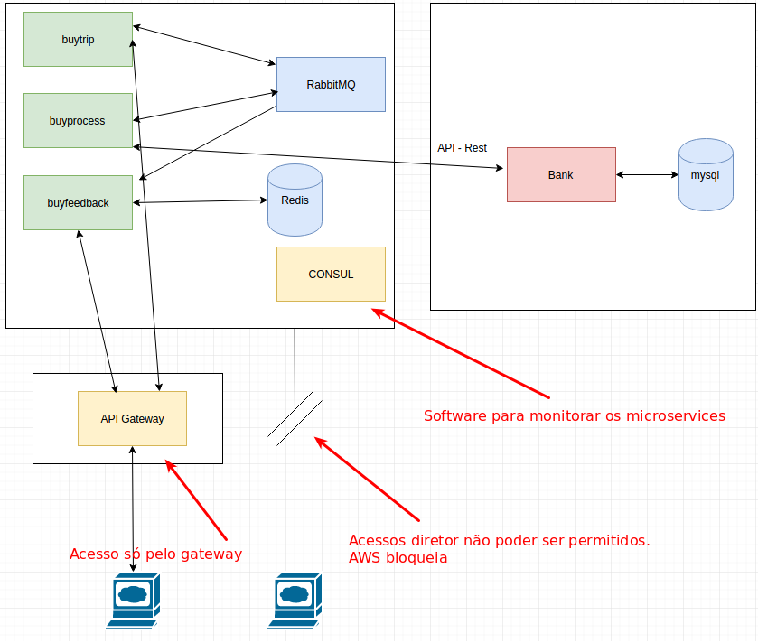

# Estudo de comunicação entre microservices usando Spring Cloud



## Configurando MySql

```docker run -p 3306:3306 -e "MYSQL_ROOT_PASSWORD=root" -e "MYSQL_USER=test" -e "MYSQL_PASSWORD=mypass" -e "MYSQL_DATABASE=mysql" -d mysql```

## Configurando RabbitMQ

```docker run -d -it --rm --name rabbitmq -p 5672:5672 -p 15672:15672 rabbitmq:3-management```

## Configurando Radis

```docker run --name some-redis -d redis redis-server --appendonly yes```